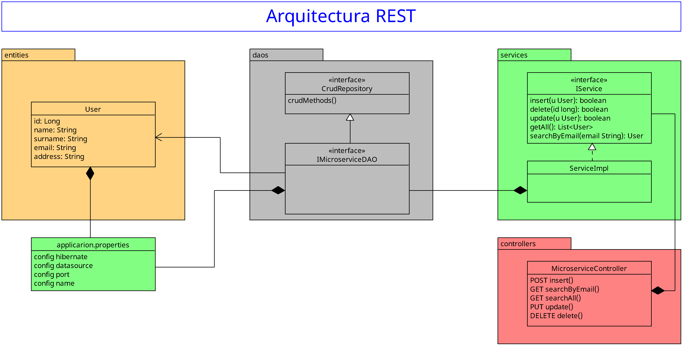

# Arquitectura del Microservicio Usuarios

Debido a la naturaleza del microservicio usuarios y que en un futuro se usara en otros microservicios se recomienda el uso de la arquitectura **RESTful**

## Stack tecnologico

1. MySQL
2. Spring Boot
3. Hibernate (**ORM**)

## Diagrama

